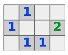

# minesweeper-puzzle-generator
Generate Minesweeper puzzles with unique solutions from the easiest to the hardest possible difficulties.


# the generator

The generator, gen.py, can generate the hardest possible Minesweeper puzzles such as the following...



Just enter the puzzle's size, the desired difficulty, and an optional random seed.

What I call Minesweeper *puzzles* have all numbers exposed before any clicks. There is one unique solution. Some would call these Tentaizu puzzles.

Unlike the best quality puzzles I've seen so far, found at [https://www.puzzle-minesweeper.com/](https://www.puzzle-minesweeper.com/), my code generates the hardest possible puzzles. This website's easy puzzles can be solved with purely one-number-at-a-time logic, and the rest of their puzzles can be solved with the addition of two-numbers-at-a-time logic. Unlike them, on top of a solver that knows this logic, I have a recursive (brute-force) algorithm that makes smart guesses before trying the less smart ones, allowing me to generate the hardest possible puzzles.

Generator notes...
* The difficulty can be selected between [https://www.puzzle-minesweeper.com/](https://www.puzzle-minesweeper.com/)'s easy, their hard, and the actual hardest possible. The actual difficulty is displayed if the target difficulty was not reached. The above tiny puzzle is harder than the website's hard.
* Any rectangular puzzle size can be chosen.
* To prevent a human solver from having to count flags, the flag count varies. There is a 25% random chance of each square being a flag, and the code redoes all the flags if the resulting could has a 5% deviation from 25%. These percentages can easily be changed.
* The random seed, the puzzle, and the SHA-256 hash of the solution are among the outputs.
* The code simply removes numbers from the puzzle in a predefined shuffled order and puts any back if removing them causes the puzzle to end up with more than 1 solution. All of the resulting puzzles have 1 unique solution.
* A 50×50 puzzle should be generated in the range from a couple minutes to a couple days. For large puzzles like this, the exponential nature of the recursive search allows for much variability in runtime! In the code, there is a commented-out breadth-first search that attempted to speed things up (it slowed things down), but it might still be useful to split my hardest difficulty levels into two different levels. An advantage of the breadth-first search is that it is closer to how a human would solve a puzzle. Though I would be very cautious in trying to differentiate between types of guessing (brute forcing) before all other non-guessing logic has been implemented.
* The solver used by a generator that is trying to make a puzzle with one solution cannot use strategies that assume a unique solution. An example of this type of strategy is: if a 2 is surrounded by three unknowns that are connected to nothing besides the 2, those three unknowns can be cleared because, even if both of the flags were in those three locations, there is no way to uniquely determine how they should be arranged. My solver does not consider this type of logic, though perhaps it should when it tests the final puzzle for difficulty. Another interesting example is below. A dot (.) means an unknown, and the vertical line is the left edge of the board. If there is a single unique solution, the unknowns directly above the 3 and the 5 must be flags. This is a real example from a real Minesweeper puzzle.
    ```
  |...
  |...
  |35.
  |...
    ```


Next steps...
* To speed up the code (perhaps by a huge amount), convert gen.py to C++! I would then convert the arrays to 1D so that we no longer need to store coordinates as tuples (if the row and column are known, 1D arrays can be accessed via \[row\*width + column\]). Since C++'s default sets are slow, I would include robin_set.h to get good sets...  
[https://github.com/Tessil/robin-map](https://github.com/Tessil/robin-map)  
Just download the 4 files at the following link and put them in the current directory...  
[https://github.com/Tessil/robin-map/tree/master/include/tsl](https://github.com/Tessil/robin-map/tree/master/include/tsl)  
Though, robin_map.h isn't needed, so, if you care, 3 files are what are actually needed.
* If you care to make many huge (or just a couple *very* huge) puzzles, there is probably a way to speed things up. Perhaps one could make a general non-brute-force solver that includes single-number and two-number logic as well as propagating to any number of numbers. I'm not convinced this will speed things up greatly, but the solver will become linearly slower in order to prevent some exponential slow down, though it could become exponentially slower because information can be propagated across the entire puzzle.


# player and solver

Paste the puzzle's size, the puzzle, and the SHA-256 hash into player.py to play the puzzle! Just insert the puzzle's size, the puzzle itself, and the solution's SHA-256 hash. The player is a bit slow for huge puzzles because its matplotlib implementation redraws the entire board for each click. A JavaScript solver would be better!

To solve puzzles at [https://www.puzzle-minesweeper.com/](https://www.puzzle-minesweeper.com/) or from player.py, solve.py will take a screenshot, solve the puzzle very quickly, then can click the flags automatically.

I thank \_\_\_\_ for writing the solve.py's solve_puzzle_w_matrix() function that uses SciPy magic! gen.py cannot use this solver because there is no way to modify it to reliably test if multiple solutions exist.

