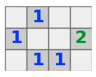

# minesweeper-puzzle-generator
Generate Minesweeper puzzles with unique solutions from the easiest to the hardest possible difficulties.


# the generator

The generator tries to generate the hardest possible Minesweeper puzzles such as the following...



What I call Minesweeper *puzzles* have all clue numbers exposed before any clicks. There is one unique solution. Some would call these Tentaizu-like puzzles.

Unlike the best quality puzzles I've seen so far, found at [https://www.puzzle-minesweeper.com/](https://www.puzzle-minesweeper.com/), my code attempts to generate the hardest possible puzzles. This website's easy puzzles can be solved with purely one-number-at-a-time logic, and the rest of their puzzles can be solved with the addition of two-numbers-at-a-time logic (based on my 2024 tests). Unlike them, on top of a solver that knows this logic, I have a fast recursive (brute-force) algorithm that makes smart guesses before trying the less smart ones and a SAT solver, allowing me to try to generate the hardest possible puzzles with the lowest runtime.

gen_sat.cpp is the recommended generator with a hybrid SAT fallback. Just enter the puzzle size, the desired difficulty, and an optional random seed. If you want puzzles optimized by evolution for difficulty, run gen_sat_evolve.cpp instead.

Before 2026, I had a simple Python version, and no C++ version. In 2026, ChatGPT helped me!
* gen.cpp was written by ChatGPT based on the simple Python version! It is almost 10 times faster in my tests.
* gen.py now has a hybrid solver that can eventually use Google's OR-Tools CP-SAT solver for hardest puzzles. gen.py is kept as a readable Python reference version with a hybrid CP-SAT fallback. CP-SAT can be 1000s of times faster for some very large and hard puzzles. When gen.py switches to CP-SAT, any progress already made by the old solver is discarded instead of being encoded into the CP-SAT model. This code was validated by making a version (not included) that runs both solvers and compares their solution counts (and prints solution times).
* gen_sat.cpp was written by ChatGPT to have a hybrid SAT fallback. The SAT solver itself is incremental. Its clauses and learned information are retained between candidate puzzles, which made repeated checks very fast in my tests. This code was validated by making a version (not included) that runs both solvers and compares their solution counts (and prints solution times).
* gen_sat_evolve.cpp was inspired by how [https://github.com/t-dillon/tdoku](https://github.com/t-dillon/tdoku) evolves Sudoku puzzles when generating them. I asked ChatGPT to implement this evolutionary approach to make the puzzles as difficult as possible according to a metric chosen experimentally to be fast and to correlate to difficulty for a human solver. I haven't tested this code deeply, tried all parameter combinations, or optimized parameter combinations, but it certainly creates difficult puzzles! In my tests (code not included), evolving by the SAT metric also substantially increased the depth required by my recursive solver, though the two rankings are not identical. This evolutionary version does not but should include assumed-uniqueness strategies when judging difficulty because it is pushing puzzles toward the limits of the evaluator, so those limits need to be clearly defined. To do this, the human-logic solver—not the SAT or recursive solver—would need an optional mode implementing certain common, explicitly defined uniqueness strategies. Also, certain regions of the final puzzle are still relatively easy. Focusing mutations on these easier regions may help, and occasionally evolving the underlying mine arrangement instead of only the exposed clues may unlock truly diabolical puzzles. Because changing the mine arrangement changes the clue values, each such solution lineage would require its own incremental SAT model.

In the directory containing gen_sat.cpp or gen_sat_evolve.cpp, run the following once...
  ```
git clone https://github.com/arminbiere/cadical.git
cd cadical
git checkout rel-3.0.0    # optional; this is the version I used
./configure && make
cd ..
  ```
This even works with Cygwin64. Then, to compile and run gen_sat.cpp, do...
  ```
g++ -std=c++17 -O3 gen_sat.cpp -Icadical/src cadical/build/libcadical.a -o gen_sat
./gen_sat
  ```
For gen_sat_evolve.cpp, do the same thing but change *gen_sat* to *gen_sat_evolve* everywhere.

Generator notes...
* The difficulty can be selected between [https://www.puzzle-minesweeper.com/](https://www.puzzle-minesweeper.com/)'s easy, their hard, and even harder. My solver can solve any solvable puzzle, so you might end up creating the world's hardest puzzle! The actual difficulty is displayed if the target difficulty was not reached. The above tiny puzzle is harder than the website's hard.
* Any rectangular puzzle size can be chosen.
* To prevent a human solver from having to count flags, the flag count varies. There is a 25% random chance of each square being a flag, and the code redoes all the flags if the result differs from 25% by more than 5 percentage points. These percentages can easily be changed.
* The random seed, the puzzle, and the SHA-256 hash of the solution are among the outputs.
* The code simply removes numbers from the puzzle in a predefined shuffled order and puts a clue back if removing it causes the puzzle to end up with more than 1 solution. All of the resulting puzzles have 1 unique solution.
* Using gen_sat.cpp, a 50×50 puzzle of the hardest difficulty should be generated in less than 10 seconds, though the final difficulty analysis might take much longer. For large puzzles like this, the exponential nature of my old recursive search allowed for extreme variability in runtime (this is the algorithm that assesses final difficulty), but the SAT and CP-SAT solvers did not have significant runtime variation!
* In the code, there is a commented-out breadth-first search that attempted to speed things up (it slowed things down), but it might still be useful to split my hardest difficulty levels into two different levels. An advantage of the breadth-first search is that it is closer to how a human would solve a puzzle. Though I would be very cautious in trying to differentiate between types of guessing (brute forcing) before all other non-guessing logic has been implemented.
* The solver used by a generator that is trying to make a puzzle with one solution cannot use strategies that assume a unique solution. An example of this type of strategy is: if a 2 is surrounded by three unknowns that are connected to nothing besides the 2, those three unknowns can be cleared because, even if both of the flags were in those three locations, there is no way to uniquely determine how they should be arranged. My solver does not consider this type of logic, though perhaps it should when it tests the final puzzle for difficulty. Another interesting example is below. A dot (.) means an unknown, and the vertical line is the left edge of the board. If there is a single unique solution, the unknowns directly above the 3 and the 5 must be flags. This is a real example from a real Minesweeper puzzle.
    ```
  |...
  |...
  |35.
  |...
    ```


If you care to make many huge (or just a couple of *very* huge) puzzles, there is probably a way to speed things up. Perhaps one could make a general non-brute-force solver that includes single-number and two-number logic as well as propagating to any number of numbers, though capped in practice. I'm not convinced this will speed things up greatly, especially since Minesweeper is NP-complete. The solver will hopefully become a couple times slower in order to prevent some exponential slowdown, though it could still become exponentially slower because information can be propagated across the entire puzzle. I probably will never pursue this because, when solving a Sudoku, it is eventually more practical to make a guess or two instead of trying ever harder strategies. However, I would pursue it if I learned that human solvers should do it, because this solver could then give better difficulty estimates of the puzzles that are created.


# player and solver

Paste the puzzle size, the puzzle, and the SHA-256 hash into player.html to play the puzzle in your web browser!

To solve puzzles at [https://www.puzzle-minesweeper.com/](https://www.puzzle-minesweeper.com/) or from player.html, solve.py will take a screenshot, solve the puzzle, then can click the flags automatically. It uses basically the same solver as one of the solvers found in gen.py.


# thanks

I thank [Nacho-Meter-Stick](https://github.com/Nacho-Meter-Stick) for optimizing some lines of my original Python solver code and inspiring me to try the depth=1 breadth-first search.

I also thank [https://www.puzzle-minesweeper.com/](https://www.puzzle-minesweeper.com/) for their great puzzles!

I thank [https://github.com/t-dillon/tdoku](https://github.com/t-dillon/tdoku) for the beautiful code that inspired my evolutionary approach.